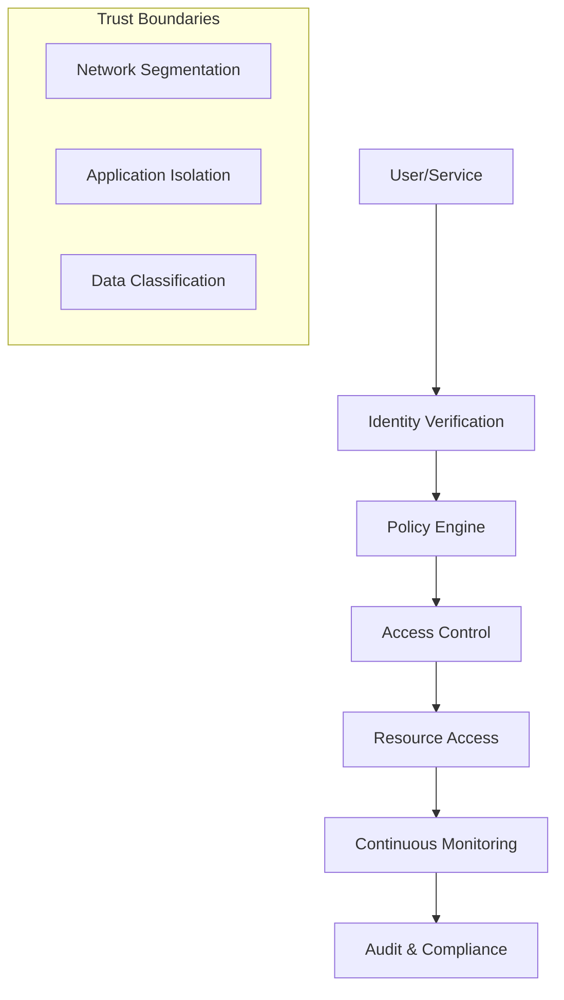

# Enterprise Security Architecture

## Overview

This document outlines the comprehensive security architecture for the Hybrid Cloud Orchestration platform, implementing defense-in-depth strategies across OpenStack, Kubernetes, and multi-cloud environments.

## Security Framework

### Zero Trust Architecture



### Security Domains

#### 1. Identity and Access Management (IAM)

**Multi-tenancy with Strong Isolation**
```yaml
# OpenStack Keystone Configuration
identity:
  keystone:
    security_compliance:
      password_regex: "^(?=.*[a-z])(?=.*[A-Z])(?=.*\d)(?=.*[@$!%*?&])[A-Za-z\d@$!%*?&]{12,}$"
      password_expires_days: 90
      lockout_failure_attempts: 5
      lockout_duration: 1800
      disable_user_account_days_inactive: 90
      unique_last_password_count: 5
    
    mfa:
      enabled: true
      methods:
        - totp
        - webauthn
        - sms
      
    session_management:
      session_timeout: 3600
      concurrent_sessions: 3
      session_binding: true
```

**Kubernetes RBAC Integration**
```yaml
# ServiceAccount with restricted permissions
apiVersion: v1
kind: ServiceAccount
metadata:
  name: hybrid-cloud-operator
  namespace: platform-system
  annotations:
    iam.gke.io/gcp-service-account: hybrid-cloud-sa@project.iam.gserviceaccount.com
    eks.amazonaws.com/role-arn: arn:aws:iam::account:role/hybrid-cloud-role

---
apiVersion: rbac.authorization.k8s.io/v1
kind: ClusterRole
metadata:
  name: hybrid-cloud-operator
rules:
- apiGroups: [""]
  resources: ["nodes", "pods", "services", "endpoints"]
  verbs: ["get", "list", "watch"]
- apiGroups: ["apps"]
  resources: ["deployments", "replicasets"]
  verbs: ["get", "list", "watch", "create", "update", "patch"]
- apiGroups: ["networking.k8s.io"]
  resources: ["networkpolicies"]
  verbs: ["get", "list", "watch", "create", "update", "patch", "delete"]

---
apiVersion: rbac.authorization.k8s.io/v1
kind: ClusterRoleBinding
metadata:
  name: hybrid-cloud-operator
roleRef:
  apiGroup: rbac.authorization.k8s.io
  kind: ClusterRole
  name: hybrid-cloud-operator
subjects:
- kind: ServiceAccount
  name: hybrid-cloud-operator
  namespace: platform-system
```

#### 2. Network Security

**Micro-segmentation Architecture**
```yaml
# Network Security Groups
security_groups:
  management:
    description: "Management network access"
    rules:
      - direction: ingress
        protocol: tcp
        port_range: "22"
        remote_ip_prefix: "10.0.0.0/8"
      - direction: ingress
        protocol: tcp
        port_range: "443"
        remote_ip_prefix: "10.0.0.0/8"
  
  compute:
    description: "Compute node communication"
    rules:
      - direction: ingress
        protocol: tcp
        port_range: "16509"  # libvirt
        remote_group_id: "management"
      - direction: ingress
        protocol: tcp
        port_range: "5900-5999"  # VNC
        remote_group_id: "management"
  
  kubernetes:
    description: "Kubernetes cluster communication"
    rules:
      - direction: ingress
        protocol: tcp
        port_range: "6443"  # API server
        remote_group_id: "management"
      - direction: ingress
        protocol: tcp
        port_range: "10250"  # kubelet
        remote_group_id: "kubernetes"
      - direction: ingress
        protocol: tcp
        port_range: "30000-32767"  # NodePort range
        remote_ip_prefix: "10.0.0.0/8"
```

**Kubernetes Network Policies**
```yaml
# Default deny-all policy
apiVersion: networking.k8s.io/v1
kind: NetworkPolicy
metadata:
  name: default-deny-all
  namespace: production
spec:
  podSelector: {}
  policyTypes:
  - Ingress
  - Egress

---
# Allow specific inter-service communication
apiVersion: networking.k8s.io/v1
kind: NetworkPolicy
metadata:
  name: allow-frontend-to-backend
  namespace: production
spec:
  podSelector:
    matchLabels:
      app: backend
  policyTypes:
  - Ingress
  ingress:
  - from:
    - podSelector:
        matchLabels:
          app: frontend
    ports:
    - protocol: TCP
      port: 8080

---
# Allow external ingress
apiVersion: networking.k8s.io/v1
kind: NetworkPolicy
metadata:
  name: allow-ingress-controller
  namespace: production
spec:
  podSelector:
    matchLabels:
      app: frontend
  policyTypes:
  - Ingress
  ingress:
  - from:
    - namespaceSelector:
        matchLabels:
          name: ingress-system
    ports:
    - protocol: TCP
      port: 80
    - protocol: TCP
      port: 443
```

#### 3. Encryption and Key Management

**Data Encryption at Rest**
```yaml
# OpenStack encryption configuration
encryption:
  cinder:
    encryption_provider: "luks"
    encryption_key_manager: "barbican"
    fixed_key: false
    
  swift:
    encryption_enabled: true
    encryption_root_secret: "${barbican_secret_ref}"
    
  nova:
    encryption_enabled: true
    encryption_api_url: "https://barbican.example.com:9311"

# Kubernetes encryption configuration
apiVersion: apiserver.config.k8s.io/v1
kind: EncryptionConfiguration
resources:
- resources:
  - secrets
  - configmaps
  - events
  providers:
  - aescbc:
      keys:
      - name: key1
        secret: <base64-encoded-32-byte-key>
  - identity: {}
```

**Certificate Management**
```yaml
# cert-manager configuration for automatic certificate management
apiVersion: cert-manager.io/v1
kind: ClusterIssuer
metadata:
  name: enterprise-ca-issuer
spec:
  ca:
    secretName: enterprise-ca-key-pair

---
apiVersion: cert-manager.io/v1
kind: Certificate
metadata:
  name: hybrid-cloud-tls
  namespace: platform-system
spec:
  secretName: hybrid-cloud-tls-secret
  issuerRef:
    name: enterprise-ca-issuer
    kind: ClusterIssuer
  dnsNames:
  - "*.hybrid-cloud.example.com"
  - "hybrid-cloud.example.com"
  organization:
  - "Enterprise Platform Team"
  duration: 2160h # 90 days
  renewBefore: 360h # 15 days
```

#### 4. Container Security

**Pod Security Standards**
```yaml
# Pod Security Policy replacement with Pod Security Standards
apiVersion: v1
kind: Namespace
metadata:
  name: production
  labels:
    pod-security.kubernetes.io/enforce: restricted
    pod-security.kubernetes.io/audit: restricted
    pod-security.kubernetes.io/warn: restricted

---
# Secure Pod specification
apiVersion: v1
kind: Pod
metadata:
  name: secure-application
  namespace: production
spec:
  serviceAccountName: application-sa
  securityContext:
    runAsNonRoot: true
    runAsUser: 10001
    runAsGroup: 10001
    fsGroup: 10001
    seccompProfile:
      type: RuntimeDefault
  containers:
  - name: app
    image: registry.example.com/app:v1.0.0
    securityContext:
      allowPrivilegeEscalation: false
      readOnlyRootFilesystem: true
      capabilities:
        drop:
        - ALL
    resources:
      limits:
        memory: "512Mi"
        cpu: "500m"
      requests:
        memory: "256Mi"
        cpu: "250m"
    volumeMounts:
    - name: tmp
      mountPath: /tmp
    - name: var-run
      mountPath: /var/run
  volumes:
  - name: tmp
    emptyDir: {}
  - name: var-run
    emptyDir: {}
```

**Image Security Scanning**
```yaml
# Falco runtime security rules
- rule: Container with Sensitive Mount
  desc: Detect container with sensitive host mount
  condition: >
    spawned_process and
    container and
    (k8s_volume_mount and 
     (ka.volume.hostpath.path startswith "/proc" or
      ka.volume.hostpath.path startswith "/var/run/docker.sock" or
      ka.volume.hostpath.path startswith "/var/lib/kubelet" or
      ka.volume.hostpath.path startswith "/etc"))
  output: >
    Container with sensitive mount (user=%user.name command=%proc.cmdline 
    mount=%ka.volume.hostpath.path container_id=%container.id 
    image=%container.image.repository)
  priority: WARNING

- rule: Suspicious Process in Container
  desc: Detect suspicious process execution in container
  condition: >
    spawned_process and
    container and
    (proc.name in (nc, ncat, netcat, nmap, wireshark, tcpdump) or
     proc.name startswith "python" and proc.cmdline contains "socket")
  output: >
    Suspicious process in container (user=%user.name command=%proc.cmdline 
    container_id=%container.id image=%container.image.repository)
  priority: HIGH
```

#### 5. Secrets Management

**HashiCorp Vault Integration**
```yaml
# Vault configuration for secrets management
apiVersion: v1
kind: ConfigMap
metadata:
  name: vault-config
  namespace: vault-system
data:
  vault.hcl: |
    storage "consul" {
      address = "consul.consul-system.svc.cluster.local:8500"
      path    = "vault/"
    }
    
    listener "tcp" {
      address     = "0.0.0.0:8200"
      tls_cert_file = "/etc/tls/tls.crt"
      tls_key_file  = "/etc/tls/tls.key"
    }
    
    seal "awskms" {
      region     = "us-west-2"
      kms_key_id = "alias/vault-unseal-key"
    }
    
    ui = true
    api_addr = "https://vault.example.com:8200"
    cluster_addr = "https://vault.example.com:8201"

---
# External Secrets Operator configuration
apiVersion: external-secrets.io/v1beta1
kind: SecretStore
metadata:
  name: vault-backend
  namespace: production
spec:
  provider:
    vault:
      server: "https://vault.vault-system.svc.cluster.local:8200"
      path: "secret"
      version: "v2"
      auth:
        kubernetes:
          mountPath: "kubernetes"
          role: "external-secrets"
          serviceAccountRef:
            name: "external-secrets-sa"

---
apiVersion: external-secrets.io/v1beta1
kind: ExternalSecret
metadata:
  name: database-credentials
  namespace: production
spec:
  refreshInterval: 300s
  secretStoreRef:
    name: vault-backend
    kind: SecretStore
  target:
    name: database-secret
    creationPolicy: Owner
  data:
  - secretKey: username
    remoteRef:
      key: database/production
      property: username
  - secretKey: password
    remoteRef:
      key: database/production
      property: password
```

#### 6. Compliance and Auditing

**OpenStack Audit Configuration**
```yaml
# Keystone audit configuration
audit:
  enabled: true
  audit_map_file: "/etc/keystone/audit_map.conf"
  
audit_middleware:
  ignore_req_list: "GET,HEAD"
  record_payloads: false
  metrics_enabled: true
  
logging:
  formatters:
    audit:
      format: '%(asctime)s - %(name)s - %(levelname)s - %(message)s'
  handlers:
    audit_file:
      class: logging.handlers.WatchedFileHandler
      filename: /var/log/keystone/audit.log
      formatter: audit
  loggers:
    keystone.common.wsgi:
      level: INFO
      handlers: [audit_file]
      propagate: false
```

**Kubernetes Audit Policy**
```yaml
# Comprehensive audit policy
apiVersion: audit.k8s.io/v1
kind: Policy
rules:
# Log security-sensitive events at RequestResponse level
- level: RequestResponse
  resources:
  - group: ""
    resources: ["secrets", "configmaps"]
  - group: "rbac.authorization.k8s.io"
    resources: ["*"]

# Log pod changes at Request level
- level: Request
  resources:
  - group: ""
    resources: ["pods", "services"]
  verbs: ["create", "update", "patch", "delete"]

# Log authentication events
- level: Metadata
  omitStages:
  - RequestReceived
  resources:
  - group: "authentication.k8s.io"
    resources: ["*"]

# Don't log read-only operations on common resources
- level: None
  resources:
  - group: ""
    resources: ["events", "nodes", "pods/log", "pods/status"]
  verbs: ["get", "list", "watch"]
```

#### 7. Security Monitoring and Incident Response

**Security Information and Event Management (SIEM)**
```yaml
# Prometheus security monitoring rules
groups:
- name: security.rules
  rules:
  - alert: UnauthorizedAPIAccess
    expr: increase(apiserver_audit_total{verb="create",objectRef_resource="secrets"}[5m]) > 10
    for: 1m
    labels:
      severity: critical
    annotations:
      summary: "Unusual secret creation activity detected"
      description: "High volume of secret creation in the last 5 minutes"

  - alert: PrivilegedContainerDetected
    expr: kube_pod_container_status_running{container=~".*"} and on(pod,namespace) kube_pod_spec_containers_security_context_privileged == 1
    for: 0m
    labels:
      severity: high
    annotations:
      summary: "Privileged container detected"
      description: "Pod {{ $labels.pod }} in namespace {{ $labels.namespace }} is running with privileged access"

  - alert: FailedLoginAttempts
    expr: increase(keystone_failed_auth_total[5m]) > 5
    for: 1m
    labels:
      severity: warning
    annotations:
      summary: "Multiple failed login attempts"
      description: "{{ $value }} failed login attempts in the last 5 minutes"
```

**Incident Response Playbook**
```yaml
# Automated incident response
apiVersion: v1
kind: ConfigMap
metadata:
  name: incident-response-playbook
  namespace: security-system
data:
  security-incident.yaml: |
    incidents:
      privilege_escalation:
        severity: critical
        actions:
          - isolate_pod
          - collect_logs
          - notify_security_team
          - create_forensic_snapshot
        
      unauthorized_access:
        severity: high
        actions:
          - revoke_credentials
          - audit_access_logs
          - notify_security_team
          - update_security_policies
        
      malware_detection:
        severity: critical
        actions:
          - quarantine_node
          - scan_cluster
          - notify_security_team
          - initiate_containment_protocol
```

## Security Best Practices

### Development Security

#### Secure Coding Guidelines
```yaml
# Git hooks for security scanning
pre_commit_hooks:
  - id: secret-detection
    name: Detect secrets
    entry: detect-secrets-hook
    language: python
    types: [text]
    
  - id: security-audit
    name: Security audit
    entry: safety check
    language: python
    files: requirements.*\.txt$
    
  - id: vulnerability-scan
    name: Vulnerability scan
    entry: bandit
    language: python
    types: [python]
    args: ['-r', '.', '-f', 'json', '-o', 'bandit-report.json']
```

#### Container Security Standards
```dockerfile
# Security-hardened Dockerfile template
FROM registry.example.com/base-images/ubuntu:20.04-hardened

# Create non-root user
RUN groupadd -r appuser && useradd -r -g appuser -u 10001 appuser

# Install only necessary packages
RUN apt-get update && apt-get install -y --no-install-recommends \
    ca-certificates \
    && rm -rf /var/lib/apt/lists/* \
    && apt-get clean

# Copy application files
COPY --chown=appuser:appuser app/ /app/

# Set working directory
WORKDIR /app

# Switch to non-root user
USER appuser

# Use exec form for better signal handling
ENTRYPOINT ["/app/entrypoint.sh"]
CMD ["app"]

# Security labels
LABEL security.scan.date="2025-08-17" \
      security.scan.tool="trivy" \
      security.compliance="cis-benchmark" \
      maintainer="security@example.com"
```

### Operational Security

#### Backup and Recovery Security
```yaml
# Encrypted backup configuration
backup:
  encryption:
    enabled: true
    algorithm: "AES-256-GCM"
    key_management: "vault"
    
  storage:
    type: "s3"
    bucket: "enterprise-backups"
    encryption: "SSE-KMS"
    access_control: "IAM"
    
  retention:
    daily: 30
    weekly: 12
    monthly: 12
    yearly: 7
    
  verification:
    integrity_check: true
    restore_test: weekly
    encryption_validation: true
```

#### Disaster Recovery Security
```yaml
# Secure disaster recovery procedures
disaster_recovery:
  rpo: "1h"  # Recovery Point Objective
  rto: "4h"  # Recovery Time Objective
  
  security_requirements:
    - encrypted_backups
    - verified_restore_points
    - isolated_recovery_environment
    - security_validation_tests
    
  procedures:
    - backup_verification
    - security_hardening
    - access_control_restoration
    - compliance_validation
    - security_audit
```

## Compliance Framework

### Regulatory Compliance

#### SOC 2 Type II Compliance
```yaml
soc2_controls:
  security:
    - logical_access_controls
    - network_security_controls
    - system_operations_controls
    
  availability:
    - system_monitoring
    - incident_response
    - change_management
    
  processing_integrity:
    - data_validation
    - error_handling
    - system_monitoring
    
  confidentiality:
    - encryption_controls
    - access_controls
    - data_classification
    
  privacy:
    - data_minimization
    - consent_management
    - data_retention
```

#### GDPR Compliance
```yaml
gdpr_compliance:
  data_protection:
    - data_encryption
    - pseudonymization
    - access_controls
    
  rights_management:
    - right_to_access
    - right_to_rectification
    - right_to_erasure
    - right_to_portability
    
  privacy_by_design:
    - data_minimization
    - purpose_limitation
    - storage_limitation
    
  breach_notification:
    - detection_procedures
    - assessment_process
    - notification_timeline
    - documentation_requirements
```

## Security Assessment and Testing

### Penetration Testing

#### Regular Security Testing Schedule
```yaml
security_testing:
  vulnerability_scanning:
    frequency: weekly
    tools:
      - nessus
      - openvas
      - nuclei
    
  penetration_testing:
    frequency: quarterly
    scope:
      - external_networks
      - internal_networks
      - web_applications
      - mobile_applications
    
  red_team_exercises:
    frequency: annually
    objectives:
      - test_detection_capabilities
      - validate_response_procedures
      - assess_security_awareness
```

### Continuous Security Monitoring

```yaml
# Security monitoring stack
monitoring:
  threat_detection:
    - intrusion_detection_system
    - behavioral_analytics
    - anomaly_detection
    
  compliance_monitoring:
    - policy_compliance
    - configuration_drift
    - access_reviews
    
  vulnerability_management:
    - automated_scanning
    - patch_management
    - risk_assessment
```

---

This security architecture provides comprehensive protection for the hybrid cloud orchestration platform while maintaining operational efficiency and compliance requirements.
